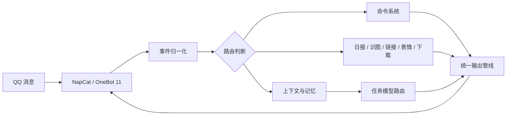

<div align="center">

# QQFriend

**基于 NapCat / OneBot 11 的模块化 QQ 机器人核心**

让对话、记忆、识图、群工具和本地运维保持可组合、可检查、可替换。

[](https://github.com/awaa4962-coder/qqbot-core/actions/workflows/ci.yml)


</div>

QQFriend 是“夜星”QQ 机器人的本地运行核心。它接收 NapCat 的 OneBot 事件，把命令、上下文、模型调用和扩展模块编排成一条可观测的回复链路，再经过统一输出清洗后发送回 QQ。

项目支持 Windows 本地运行，并提供独立的 Linux 服务器预览部署。QQ 账号、群白名单、模型密钥和运行记忆均留在各自运行环境，不随源码或发布包上传，也不会在 Windows 与 Linux 之间自动迁移。

## 能力概览

当前开发目标为 Linux 服务器，Windows 安装暂停更新。Linux 控制台的「诊断」页可查看实际消息阶段记录，并使用合成样例生成对照、保存基线和评价答案。更新顺序见 [Linux 推进计划](deploy/linux/ROADMAP.md)。

Linux `1.4.9-security-patch` 更新图片解码与开发工具安全依赖；部署时需重建依赖镜像，不能仅覆盖旧镜像的源码。使用 `npm run check:dependencies` 核对实际版本，详情见 [Linux 部署说明](deploy/linux/README.md)。

上下文选择使用中文分词、同义表达、引用关系和发送人范围；诊断中能查看入选来源，回放包含 11 个合成场景，其中新增场景实际执行记忆召回和群话题选择。相关性选择不额外调用模型，也不增加持久化向量索引。

Linux 网页「日报」支持按群和日期生成草稿、显示进度、编辑正文、比较版本、查看证据及单个讨论重写。预览不会发送到 QQ，发送需要单独操作；已发送的群和日期不会重复发布。详情见 [日报工作台](deploy/linux/SUMMARY-WORKBENCH.md)。

`1.4.12-model-refresh` 同步 DeepSeek V4.1 Flash、MiMo 2.6 Flash / Pro 官方预设。服务器实例原位升级，任务分配、思考档位与 DeepSeek 兜底保持不变；既有自定义配置不会被新默认值偷偷覆盖。Windows 安装继续冻结。

控制台现已按页面模块组织；表情分析与回放等耗时操作显示后台任务状态，刷新后继续查看原任务，不会自动重新执行。代码边界、兼容接口和验证方式见 [模块维护说明](deploy/linux/MODULAR-RUNTIME.md)。

下一轮改造的 [智能化与模块化总路线](deploy/linux/ROADMAP.md) 与 [目标实现清单](deploy/linux/MODULAR-RUNTIME.md#目标实现说明) 已整理，覆盖能力自描述、对话与记忆、梗库退役、提示词、缓存及前端。它们是待实施规划，不代表这些改造已上线；现有运行版本不因文档更新而改变。

`1.4.13-capability-state` 是 P1 的首个代码批次：能力页和帮助读取实际聊天/视觉任务配置，分开显示启用、会话许可及依赖状态；配置就绪不代表模型接口已探测在线。JM 下载保留，状态来自既有依赖检查。聊天侧自身能力接入仍在后续计划中。

`1.4.14-meme-retirement` 停用自动梗库的学习、定时联网更新和提示词注入。旧命令返回停用说明，旧写入接口返回退役状态；原数据保留为「维护与外观 → 旧梗库归档」，只读且不自动恢复内置词条。识图、表情采集/发送、JM、链接预览及普通搜索继续保留；这不是新的自动梗库。

`1.4.15-self-context` 为聊天模型加入当前会话权限内的能力事实和本次请求模型标识，主备切换会重新生成，不提供密钥、源码或名单。主动沉默不会再触发备用模型硬接话；两边失败不再随机补短句，直接提问会收到明确失败提示。诊断页区分主动不回复与故障；JM 仍完整保留。此批不代表 P1-P5 全部完成。

`1.4.16-chat-lifecycle` 在聊天生成、备用调用、分段发送和成功记忆回写之间复核隐私与权限；清理记忆或修改称呼/风格后，旧回复不会在后续检查点继续外发或回填。前端显示已停止、部分发送和回执未知，不伪称已送达内容可撤回。JM 命令不进入普通聊天的私聊权限门，原独立白名单不变。

`1.4.17-prompt-layers` 将固定任务规则和每轮表达设置分开，历史按完整轮次保留，长摘录保留首尾。诊断中可查看提示词版本、固定前缀指纹与文本长度；供应商实际用量仍以 API 返回的 token 统计为准，固定前缀不保证一定命中缓存。此为 2.0.0 总路线中的阶段性交付。

群聊可用 `@夜星 总结我`、`@夜星 总结 @某人 昨天`，或 `@夜星 分别总结 @甲 @乙 今天`，把指定成员的聊天用自然的话讲清楚。默认最近两小时、最多五人，仅使用本群已采集文字；普通成员可用，由管理员在「配置 → 聊天总结群」控制。具体用法见 [成员聊天总结](deploy/linux/MEMBER-SUMMARY.md)。

| 方向 | 当前能力 |
| --- | --- |
| 对话与模型 | 按任务配置 MiMo、DeepSeek 或自定义模型的主备与思考强度，兼容 OpenAI Chat / Responses、Anthropic 和 Gemini 协议 |
| 上下文与记忆 | 群聊短期线程、相关历史召回、用户称呼与回复偏好、关系摘要、跨群隔离和硬预算控制 |
| 图片与表情 | 图片上下文理解、视觉模型兜底、QQ 收藏表情同步、语境召回、白名单群表情采集与去重 |
| 群工具 | 每日群报、词云、关系状态、能力查询、版本日志和管理员诊断 |
| 链接预览 | B站、GitHub 仓库和普通网页的安全预览，支持去重、重定向校验和图片内存代理 |
| 文件与下载 | 白名单资源转发、JM 代码下载、加密压缩与临时文件生命周期管理 |
| 本地控制台 | 服务启停、健康状态、API 快拆、配置编辑、日志诊断、模块清单、旧词条只读归档和表情管理 |

## 工作链路



核心原则是让每个模块只处理自己的职责：入口负责解析，路由负责选择，模型层负责生成，输出层负责清洗与发送。单个扩展失败不会直接拖垮主回复链路。

## 快速开始

### 运行环境

- Windows 10 / 11
- Node.js 22 或更新版本
- 已安装并登录的 NapCat `v4.18.13`
- 至少一个可用的模型 API

Linux 服务器使用 Node.js 22 与 NapCat Docker，完整说明见 [`deploy/linux/README.md`](deploy/linux/README.md)。

### 安装

```powershell
git clone https://github.com/awaa4962-coder/qqbot-core.git
cd qqbot-core
npm.cmd ci
```

按照 [`.env.example`](.env.example) 在本机创建所需的 `.env_*` 文件。真实密钥不要写进源码、测试、日志或提交记录。

### 启动

完整启动 NapCat 与 Bridge：

```powershell
.\start_bridge.bat
```

只启动 Bridge：

```powershell
npm.cmd start
```

检查健康状态：

```powershell
Invoke-RestMethod http://127.0.0.1:16789/health
```

正常响应包含：

```json
{
  "status": "ok"
}
```

### Linux 服务器预览

Linux 部署与 Windows 状态完全分开。初始化后补齐 Linux 自己的密钥和白名单，再通过 Docker Compose 启动：

```bash
cd deploy/linux
chmod +x prepare.sh check.sh
./prepare.sh
docker compose --env-file .env up -d --build
./check.sh --runtime
```

管理页面只监听服务器环回地址。使用 SSH 隧道后，在本机打开 `http://127.0.0.1:16789/console/`：

```bash
ssh -L 16789:127.0.0.1:16789 -L 6099:127.0.0.1:6099 miku-server
```

## 常用命令

群聊命令必须先 `@机器人`，私聊命令可以省略：

```text
@夜星 帮助
@夜星 状态
@夜星 更新
@夜星 关系
@夜星 我的档案
@夜星 回复风格 简短 技术 给步骤
@夜星 JM怎么用
```

管理员命令需要配置 `QQBOT_ADMINS` 或 `.env_admins`：

```text
@夜星 管理帮助
@夜星 运行状态
@夜星 memory status
```

帮助、命令注册和能力中心共用同一份声明，新增模块时不需要维护多套互相漂移的命令列表。

## 本地控制台

Windows 控制台把常用维护动作放到可视化界面中：

- 查看 Bridge、NapCat、内存和消息风暴状态
- 一键启动、停止、重启和健康检查
- 配置模型供应商、协议、任务路由与思考强度
- 编辑白名单、机器人名称和功能开关
- 管理梗库、QQ 收藏表情与群采集策略
- 查看脱敏日志、运行诊断、模块清单和审计记录

控制台只连接本机管理端口；API Key 不会通过管理快照返回给前端。

## 模块结构

```text
bridge/
  api-providers/       模型协议、预设、任务路由与密钥边界
  capabilities/        能力目录与用户查询
  cognition/           短期对话线程和完成回合
  commands/            命令注册、标准化与分发
  context/             上下文分层、历史和硬预算
  features/            表情等独立扩展
  group-summary/       群日报证据、提示词、模型与格式化
  services/            链接预览等外部服务
launcher/              Windows 控制台与 Linux 可复用浏览器界面
deploy/linux/          Docker Compose、systemd 与 Linux 运维脚本
scripts/               发布、诊断、脚手架和运行检查
test/                  模块、集成、安全和回归测试
```

模块能力和健康检查登记在 [`bridge/modules/manifest.mjs`](bridge/modules/manifest.mjs)，命令扩展可通过脚手架生成基础文件：

```powershell
npm.cmd run command:scaffold -- weather --aliases=weather,天气 --help="天气 <城市>"
```

脚手架默认只预览；确认生成内容后追加 `--write` 才会写入文件。

## 安全与隐私

- `reasoning_content`、分析字段和思维过程不能进入最终 QQ 消息。
- 外部 URL 每次重定向都会重新检查，内网、localhost 和链路本地地址会被拒绝。
- 链接与识图图片优先在内存中处理，不作为长期图片文件保存。
- 群上下文按群和用户隔离，私聊短期线程只保留在进程内存中。
- 日志只记录脱敏摘要，不打印完整密钥或模型私有推理。
- 发布检查会拦截 `.env*`、运行记忆、日志、备份、个人文档和本机路径。
- `export-relationships` 仍是预留能力，不会生成真实关系表。

## 开发与验收

```powershell
npm.cmd ci
npm.cmd run lint
npm.cmd test
npm.cmd run release:check
npm.cmd run replay:check
```

测试不连接真实 NapCat，不调用真实模型 API，也不依赖真实密钥。发布检查会额外验证运行配置、JM 依赖、敏感路径、ZIP 路径和发布清单。

## 文档

- [更新日志](CHANGELOG.md)
- [环境变量示例](.env.example)
- [协作与发布工作流](WORKFLOW.md)
- [模块清单](bridge/modules/manifest.mjs)

## License

[ISC](LICENSE)
