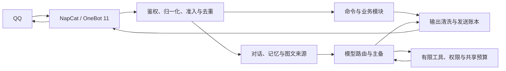

<div align="center">

# 夜星 QQ 机器人（QQFriend）

**能聊天、记事、看图、生成群报和调用受控工具的 QQ 机器人，配套中文网页控制台。**

[](https://github.com/awaa4962-coder/qqbot-core/releases/tag/v2.0.1)
[](https://github.com/awaa4962-coder/qqbot-core/actions/workflows/ci.yml?query=branch%3Aagent%2Flinux-server-preview)


[](https://github.com/awaa4962-coder/qqbot-core/blob/v2.0.1/LICENSE)

[下载 2.0.1](https://github.com/awaa4962-coder/qqbot-core/releases/tag/v2.0.1) · [Linux 部署](https://github.com/awaa4962-coder/qqbot-core/blob/agent/linux-server-preview/deploy/linux/README.md) · [更新日志](https://github.com/awaa4962-coder/qqbot-core/blob/agent/linux-server-preview/CHANGELOG.md)

</div>

QQFriend 是“夜星”的运行核心。它通过 NapCat / OneBot 11 接收 QQ 消息，结合当前对话、引用和本人记忆回答问题，也能处理图片、群日报、链接预览和表情。开启受控工具后，可以查公开资料、读本轮附件、做计算和准备本人提醒；涉及保存或提醒的操作仍须本人确认。服务、模型、名单和任务状态都可在中文网页控制台管理。

> 当前主维护版本为 **Linux 2.0.1**。`master` 保留旧版代码；部署请选择 `v2.0.1`，参与开发请选择 `agent/linux-server-preview`。Windows 现有安装暂停更新，不自动迁移账号、密钥或聊天数据。

## 能做什么

| 能力 | 具体功能 |
| --- | --- |
| 对话与模型 | 按任务配置主备模型、接口预设和思考强度；最终正文清洗后再发送 |
| 上下文与记忆 | 区分当前发言人、引用作者和被 @ 对象；关联相关历史、本人明确记忆与称呼偏好，处理纠正、到期和遗忘 |
| 图片与表情 | 结合所选对话看图，支持原图入模或视觉描述兜底；同步 QQ 收藏表情、群采集与去重 |
| 日报与成员总结 | 按群和日期生成日报，编辑和查看证据；总结本人或本轮明确指定成员的聊天 |
| 链接预览 | B站、GitHub 和普通网页预览，复用安全读取、重定向检查和去重 |
| 下载与转发 | JM 编号下载、压缩和临时文件管理；群与私聊分别使用业务白名单，压缩密码保留大写 `FS` |
| 中文控制台 | 查看服务状态、配置 API 与路由、编辑名单和明确记忆、管理表情、查看后台任务与脱敏诊断 |
| 缓存与用量 | 稳定提示词前缀、精确同图分类复用与有范围的识图缓存；分开查看供应商 token 命中和本进程分类复用，不缓存最终聊天答案 |

模型协议支持 OpenAI Chat / Responses、Anthropic 和 Gemini 适配。协议能接通不代表任意模型都支持识图、原生工具或全部思考参数，能力以当前接口配置及实际验证为准。

## 受控工具调用

在开放功能的群里真正 **@机器人**，可以直接说需求：

| 你可以这样问 | 后端允许做的事 |
| --- | --- |
| `@夜星 算一下 21 乘 2` | 调用受限计算器，不执行脚本 |
| `@夜星 搜索 Debian 最新版本` | 使用本条明确授权的公开关键词搜索 |
| `@夜星 阅读这个链接，说明主要结论：链接` | 读取本轮授权的公开来源，并说明读取范围 |
| 随文本附件发送 `@夜星 找出超时设置` | 按需读取当前文本附件，不开放本机文件系统 |
| `@夜星 总结我今天的聊天，先给草稿` | 复用已有总结服务，不自动正式发布日报 |
| `@夜星 以后叫我小夏` | 准备本人的资料变更草稿，等待本人确认 |
| `@夜星 十分钟后提醒我喝水` | 准备单次提醒，确认前不生效 |

模型生成的资料变更和提醒，需要本人另发机器人给出的 `@夜星 确认 cf_编号`。示例编号不能执行；管理员也不能代他人确认。

新工具默认受群名单及阶段名单限制，不因发布版本自动向全部群开放，也不新增开放私聊或自动插话。每轮主备共享 **4 个模型轮次 / 4 次工具调用 / 90 秒 / 8 次模型 HTTP 尝试**；这不是无限循环或所有网络请求的总数。

<details>
<summary>查看 11 个工具及权限边界</summary>

| 工具 | 范围 |
| --- | --- |
| `recall_memory` | 本人、当前会话的明确记忆与保留记录 |
| `read_bot_status` | 当前权限内的功能、版本和状态 |
| `web_search` | 本条明确授权的公开关键词 |
| `calculate` | 有限数值表达式 |
| `read_public_page` | 后端分配的本轮公开来源引用 |
| `read_current_attachment` | 后端分配的本轮文本附件引用 |
| `draft_chat_summary` | 当前群、允许对象的总结草稿 |
| `read_draft_task` | 本人在当前群的草稿状态或取消请求 |
| `prepare_personal_change` | 本人的具体资料变更草稿，不自动写入 |
| `prepare_reminder` | 本人当前群的单次提醒草稿 |
| `read_personal_actions` | 本人当前群的确认与提醒状态 |

没有 shell、任意路径读取、服务器管理、跨用户写入或模型代确认工具。网页和附件是资料，不是取得权限的指令。普通对话有足够材料时可以直接回答，不必每轮调用工具。

</details>

## Linux 快速开始

需要 Docker Engine 与 Docker Compose v2；已完成部署验证的是 Linux amd64。Node.js 22 与 Python 依赖由 Bridge 镜像提供，本机开发才需要单独安装。

### 1. 取正式版本并初始化

```bash
git clone --branch v2.0.1 --depth 1 https://github.com/awaa4962-coder/qqbot-core.git qqfriend
cd qqfriend/deploy/linux
bash prepare.sh
```

初始化只准备独立配置与状态目录，不包含你的账号或密钥。启动前填写：

| 位置 | 用途 |
| --- | --- |
| `qqfriend.env` | 机器人 QQ 号、业务名单及运行设置 |
| `state/qqfriend/config/.env_*` | 实际使用的模型、搜索与 OneBot 认证凭据 |
| `.env` | Docker 参数、NapCat 账号及镜像设置 |

`prepare.sh` 会生成管理令牌、OneBot 令牌及 NapCat WebUI 配置。凭据保留在自己的服务器上，不要上传到 GitHub 或发送到群里。配置格式、未使用能力的处理和首次登录见 [完整部署说明](https://github.com/awaa4962-coder/qqbot-core/blob/agent/linux-server-preview/deploy/linux/README.md)。

### 2. 启动并连接管理界面

在服务器的 `deploy/linux` 目录运行：

```bash
docker compose --env-file .env up -d --build
```

在自己的电脑建立 SSH 隧道，将示例中的用户与地址换成自己的：

```bash
ssh -N -L 16789:127.0.0.1:16789 -L 6099:127.0.0.1:6099 user@your-server
```

- QQFriend 控制台：`http://127.0.0.1:16789/console/`
- NapCat 登录界面：`http://127.0.0.1:6099/webui`

在 NapCat 完成 QQ 登录及 OneBot 连接设置。Docker 网络内的反向 WebSocket 使用 `ws://bridge:16789`，不能把容器自己的 `127.0.0.1` 当成 Bridge；HTTP/WS 使用初始化生成的同一个 OneBot 令牌。

首次登录后设置自己的 `NAPCAT_ACCOUNT`，后续启动复用持久登录状态。设备验证或登录过期仍可能需要人工处理。

### 3. 检查连接

```bash
curl -fsS http://127.0.0.1:16789/health
curl -fsS http://127.0.0.1:16789/ready
```

`/health` 为 `ok`，且 `/ready` 为 `ready` 才表示对应运行与连接检查通过；进程在线不等于 QQ 已登录。管理端口默认只绑定服务器环回地址，不建议直接暴露公网。

需要每日自动群报时，按部署说明设置 `Asia/Shanghai` 时区并安装唯一日报计划；只执行 `docker compose up` 不会替你安装这项定时任务。已有服务器升级前先备份和检查数据兼容，不用旧备份覆盖新增记忆或发送状态。

## 常用命令

群聊请用 QQ 的 @ 功能选择机器人；私聊的普通命令可省略 @，聊天和业务功能仍分别检查准入。

```text
@夜星 帮助
@夜星 状态
@夜星 版本
@夜星 更新
@夜星 我的档案
@夜星 缓存命中率
@夜星 总结我
@夜星 我的提醒
@夜星 jm <编号>
```

管理员配置使用 `QQBOT_ADMINS` 或 `.env_admins`，例如 `@夜星 管理帮助`、`@夜星 运行状态`。关系查询保留原功能，`export-relationships` 仍预留，不生成真实关系表。

## 模块如何配合


```mermaid
flowchart LR
    QQ["QQ"] --> NC["NapCat / OneBot 11"]
    NC --> IN["鉴权、归一化、准入与去重"]
    IN --> CMD["命令与业务模块"]
    IN --> CTX["对话、记忆与图文来源"]
    CTX --> LLM["模型路由与主备"]
    LLM --> TOOLS["有限工具、权限与共享预算"]
    TOOLS --> LLM
    CMD --> OUT["输出清洗与发送账本"]
    LLM --> OUT
    OUT --> NC
    NC --> QQ
```

| 目录 | 主要职责 |
| --- | --- |
| `bridge/api-providers/` | 协议、预设、任务路由、用量与凭据边界 |
| `bridge/commands/`、`capabilities/` | 命令声明、分发、帮助和能力目录 |
| `bridge/cognition/`、`context/`、`memory-profile/` | 对话生命周期、来源选择、明确记忆与失效保护 |
| `bridge/chat-tools/`、`agent-reminders/` | 有限工具、本人确认、草稿与持久提醒 |
| `bridge/group-summary/`、`vision/`、`jm/`、`services/` | 日报、图文、下载与链接业务 |
| `launcher/QQFriendLauncher/Web/` | Linux 可复用的中文浏览器控制台 |
| `deploy/linux/`、`scripts/`、`test/` | 部署、发布检查、脚手架与回归测试 |

沿用一个注册表、模型路由与发送边界，不给每个功能再造一套 Agent。详细职责见 [模块文档](https://github.com/awaa4962-coder/qqbot-core/blob/agent/linux-server-preview/deploy/linux/MODULAR-RUNTIME.md)。

## 隐私与已知限制

- 模型输出只允许最终正文；`reasoning_content` 不作为回复，日志不打印完整密钥或私有推理。
- 群与本人资料有范围检查，确认绑定发起人、会话和参数；未知写入或发送结果不自动重放。
- 外部读取逐跳检查 URL、DNS 和重定向；网页与附件不能借内容绕过工具权限。
- QQ 状态、密钥、聊天与记忆留在各自部署目录，不进入公开发布包；必要的聊天和图像会发送给配置的模型提供方，本地遗忘不能撤回供应商已经接收的请求。
- 自动梗库已停用，旧词条只保留只读归档；关系表导出未启用。
- 2.0.0 保留 **9 条回答质量评测反例**，涉及图文语气、记忆指代等；上线观察另有 **2 次主备无最终正文导致的不回复**。它们没有被改记为通过，识图、工具选择和模型理解不保证绝对正确。
- 下载与转发只用于有权限的资源；白名单和压缩密码不能代替资源授权。

## 开发与文档

本地开发使用 `agent/linux-server-preview` 分支和 Node.js 22。Linux 整批验收入口：

```bash
npm ci
npm run release:check
npm run replay:check
```

`release:check` 已包含依赖、lint、测试与运行检查；同一候选无需为统计重复跑整套测试。真实模型探测可能计费，需要另行明确授权，不由离线检查自动发起。

2.0.1 发布源码的实际 Linux 验收快照为 **3112 项 / 3069 通过 / 43 项环境可选 / 0 失败**，ESLint 0 errors / 0 warnings，13 项离线回放通过，333 个运行文件与候选源码一致；环境可选项不算通过。这是该发布的记录，不是未来版本的永久保证。缓存收益由正常流量观察，不通过填充提示词或付费预热制造命中率，也不保证节费比例。

| 文档 | 内容 |
| --- | --- |
| [部署与运维](https://github.com/awaa4962-coder/qqbot-core/blob/agent/linux-server-preview/deploy/linux/README.md) | 登录、连接、定时任务、备份和升级 |
| [有限工具](https://github.com/awaa4962-coder/qqbot-core/blob/agent/linux-server-preview/deploy/linux/CHAT-TOOLS.md) | 工具参数、权限、协议和额度 |
| [记忆与隐私](https://github.com/awaa4962-coder/qqbot-core/blob/agent/linux-server-preview/deploy/linux/MEMORY.md) | 明确记忆、纠正、遗忘和恢复边界 |
| [日报工作台](https://github.com/awaa4962-coder/qqbot-core/blob/agent/linux-server-preview/deploy/linux/SUMMARY-WORKBENCH.md) | 草稿、证据、编辑和正式发送 |
| [更新日志](https://github.com/awaa4962-coder/qqbot-core/blob/agent/linux-server-preview/CHANGELOG.md) | 历代版本，不在首页堆叠交付历史 |
| [发布记录](https://github.com/awaa4962-coder/qqbot-core/blob/agent/linux-server-preview/deploy/linux/FINISH-2.0.0.md) | 2.0.0 验收、实际部署与保留限制 |
| [协作工作流](https://github.com/awaa4962-coder/qqbot-core/blob/agent/linux-server-preview/WORKFLOW.md) | 模块化分工、回归和发布规则 |

## 许可协议

[ISC](https://github.com/awaa4962-coder/qqbot-core/blob/v2.0.1/LICENSE)
