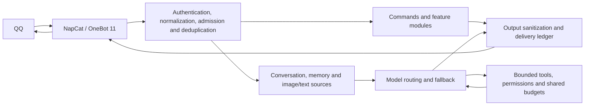

<div align="center">

# QQFriend

**A Linux-first modular QQ bot with chat, memory, vision, group tools, bounded agent capabilities, and a Chinese web console.**

[](https://github.com/awaa4962-coder/qqbot-core/releases)
[](https://github.com/awaa4962-coder/qqbot-core/actions/workflows/ci.yml?query=branch%3Aagent%2Flinux-server-preview)


[](https://github.com/awaa4962-coder/qqbot-core/blob/agent/linux-server-preview/LICENSE)

[Download a Release](https://github.com/awaa4962-coder/qqbot-core/releases/latest) | [Linux Deployment](https://github.com/awaa4962-coder/qqbot-core/blob/agent/linux-server-preview/deploy/linux/README.md) | [Changelog](https://github.com/awaa4962-coder/qqbot-core/blob/agent/linux-server-preview/CHANGELOG.md)

</div>

QQFriend powers the Yexing QQ bot. It receives messages through NapCat / OneBot 11 and combines the current conversation, quoted sources, and personal memory to answer questions. It also handles images, group reports, link previews, and stickers. When enabled, bounded tools can search public information, read current attachments, calculate results, and prepare personal reminders. Personal changes and reminders require a separate confirmation from their owner. Services, model routes, allowlists, and task status are managed through a Chinese web console.

> **Linux 2.0.2 is released and deployed.** Use the [validated release](https://github.com/awaa4962-coder/qqbot-core/releases/tag/v2.0.2) for deployment and `agent/linux-server-preview` for development. `master` retains legacy code; its README is an overview, not a deployment source. Existing Windows installations are frozen. Accounts, credentials, and chat data are not migrated automatically.

## Features

| Capability | What it does |
| --- | --- |
| Chat and models | Per-task primary/fallback models, API presets, and reasoning settings; only sanitized final text is sent |
| Context and memory | Distinguishes the current speaker, quoted authors, and mentioned users; retrieves relevant history, explicit personal memory, and naming preferences, with correction, expiry, and forgetting |
| Vision and stickers | Reads images alongside selected conversation context using original pixels or a vision-description fallback; syncs QQ favorite stickers and supports group capture and deduplication |
| Reports and member summaries | Generates reports by group and date, with evidence review and editing; summarizes the requester or explicitly selected members |
| Link previews | Bilibili, GitHub, and general web previews using shared safe fetching, redirect validation, and deduplication |
| Downloads and transfer | JM code-based downloads, archives, and temporary-file management; group and private-chat access use separate allowlists, with uppercase `FS` preserved as the archive password |
| Chinese web console | Service status, API providers and routes, allowlists, explicit memory, stickers, background tasks, and redacted diagnostics |
| Caching and usage | Stable prompt prefixes, exact-image classification reuse, and scoped vision caching; provider token-cache metrics and per-process classification reuse are separate, and final chat answers are not shared |

Sticker replies run after a confirmed text reply. Their default trigger probability is 50% for both ordinary and strong-context replies, without an additional passive-chat discount. Allowlists, switches, cooldown, usable send materials, and semantic matching still apply: this does not guarantee an image on half of all replies. The sticker page separates skipped, shadow, cancelled, failed, unknown, partial, and confirmed-send outcomes. Unknown or partially confirmed deliveries are not replayed as replacement images.

Protocol adapters cover OpenAI Chat / Responses, Anthropic, and Gemini. A working endpoint does not guarantee that every model supports vision, native tools, or all reasoning parameters. Capabilities depend on the configured endpoint and actual verification.

## Bounded Agent Tools

In an enabled group, use a **real QQ mention of the bot** and state your request. Examples below preserve the existing Chinese bot name and command text; the English documentation does not introduce new command aliases.

| Example request | Permitted operation |
| --- | --- |
| `@夜星 算一下 21 乘 2` | Calculate 21 times 2 with a bounded calculator, without executing scripts |
| `@夜星 搜索 Debian 最新版本` | Search the public keywords explicitly authorized by this message |
| `@夜星 阅读这个链接，说明主要结论：链接` | Read an authorized public source for this turn and disclose the reading scope |
| Send a text attachment with `@夜星 找出超时设置` | Read relevant parts of the current text attachment, without opening the local filesystem |
| `@夜星 总结我今天的聊天，先给草稿` | Draft a summary using the existing service, without automatically publishing a report |
| `@夜星 以后叫我小夏` | Prepare a change to the requester's naming preference and wait for owner confirmation |
| `@夜星 十分钟后提醒我喝水` | Prepare a one-time reminder that remains inactive until confirmed |

Personal changes and reminders proposed by the model require the owner to send the separate confirmation command supplied by the bot: `@夜星 确认 cf_<confirmation_id>`. Placeholder IDs cannot execute anything; administrators cannot confirm on another person's behalf.

New tools are controlled by group and phase allowlists. A release does not automatically enable them for every group, private chat, or automatic interjection. Primary and fallback share **4 model rounds / 4 tool calls / 90 seconds / 8 model HTTP attempts** per turn. These are bounded limits, not an unlimited loop or a count of all network requests.

<details>
<summary>All 11 tools and their permission boundaries</summary>

| Tool | Scope |
| --- | --- |
| `recall_memory` | The requester's explicit memory and retained records within the current conversation |
| `read_bot_status` | Features, version, and status within current permissions |
| `web_search` | Public keywords explicitly authorized by the current message |
| `calculate` | Bounded numeric expressions |
| `read_public_page` | Public-source references assigned by the backend for this turn |
| `read_current_attachment` | Current text-attachment references assigned by the backend |
| `draft_chat_summary` | Summary drafts for permitted subjects in the current group |
| `read_draft_task` | The requester's draft status or cancellation request in the current group |
| `prepare_personal_change` | A specific personal-change draft, without automatic persistence |
| `prepare_reminder` | A one-time reminder draft for its owner in the current group |
| `read_personal_actions` | The requester's confirmation and reminder status in the current group |

There are no tools for shell access, arbitrary paths, server administration, cross-user writes, or model-generated confirmation. Pages and attachments are source material, not instructions that grant permissions. Ordinary chat can answer directly when sufficient context is available; tools are not mandatory on every turn.

</details>

## Linux Quick Start

Requires Docker Engine and Docker Compose v2. The verified deployment target is Linux amd64. The Bridge image includes Node.js 22 and Python dependencies; separate installation is only needed for local development.

### 1. Get the Release and Initialize

```bash
git clone --branch v2.0.2 --depth 1 https://github.com/awaa4962-coder/qqbot-core.git qqfriend
cd qqfriend/deploy/linux
bash prepare.sh
```

Initialization prepares isolated configuration and state directories. It does not include your account or credentials. Before startup, configure:

| Location | Purpose |
| --- | --- |
| `qqfriend.env` | Bot QQ account ID, feature allowlists, and runtime settings |
| `state/qqfriend/config/.env_*` | Credentials for the model, search, and OneBot services you use |
| `.env` | Docker parameters, NapCat account, and image settings |

`prepare.sh` generates an admin token, a OneBot token, and NapCat WebUI configuration. Keep credentials on your own server; do not upload them to GitHub or send them to a group. Configuration formats, unused capabilities, and first login are covered in the [deployment guide](https://github.com/awaa4962-coder/qqbot-core/blob/agent/linux-server-preview/deploy/linux/README.md).

### 2. Start and Connect to the Console

Run from the server's `deploy/linux` directory:

```bash
docker compose --env-file .env up -d --build
```

Create an SSH tunnel from your own computer, replacing the example user and server address:

```bash
ssh -N -L 16789:127.0.0.1:16789 -L 6099:127.0.0.1:6099 user@your-server
```

- QQFriend console: `http://127.0.0.1:16789/console/`
- NapCat login: `http://127.0.0.1:6099/webui`

Complete QQ login and OneBot connection setup in NapCat. Inside the Docker network, the reverse WebSocket endpoint is `ws://bridge:16789`; a container's own `127.0.0.1` is not the Bridge service. HTTP and WebSocket use the same OneBot token generated during initialization.

After the first login, set your own `NAPCAT_ACCOUNT`. Later starts reuse persisted login state, although device verification or expired login sessions may still require manual action.

### 3. Check Readiness

```bash
curl -fsS http://127.0.0.1:16789/health
curl -fsS http://127.0.0.1:16789/ready
```

`/health` must report `ok` and `/ready` must report `ready` for the corresponding runtime and connection checks to pass. A running process does not mean QQ is logged in. Management ports bind to server loopback by default and should not be exposed directly to the public internet.

For automatic daily group reports, set the `Asia/Shanghai` timezone and install the single report schedule described in the deployment guide. `docker compose up` alone does not install it. Before upgrading an existing server, back up its state and check compatibility. Never overwrite newer memory or delivery state with an old backup.

## Common Commands

Use QQ's mention picker to select the bot in group chats. Ordinary private-chat commands can omit the mention; chat and feature access are still checked independently. These examples retain the existing Chinese command syntax:

```text
@夜星 帮助
@夜星 状态
@夜星 版本
@夜星 更新
@夜星 我的档案
@夜星 缓存命中率
@夜星 总结我
@夜星 我的提醒
@夜星 jm <编号>
```

Configure administrators through `QQBOT_ADMINS` or `.env_admins`. Examples include `@夜星 管理帮助` for admin help and `@夜星 运行状态` for runtime status. Existing relationship queries remain available; `export-relationships` stays reserved and does not export a real relationship table.

## Architecture


```mermaid
flowchart LR
    QQ["QQ"] --> NC["NapCat / OneBot 11"]
    NC --> IN["Authentication, normalization, admission and deduplication"]
    IN --> CMD["Commands and feature modules"]
    IN --> CTX["Conversation, memory and image/text sources"]
    CTX --> LLM["Model routing and fallback"]
    LLM --> TOOLS["Bounded tools, permissions and shared budgets"]
    TOOLS --> LLM
    CMD --> OUT["Output sanitization and delivery ledger"]
    LLM --> OUT
    OUT --> NC
    NC --> QQ
```

| Directory | Responsibility |
| --- | --- |
| `bridge/api-providers/` | Protocols, presets, task routes, usage accounting, and credential boundaries |
| `bridge/commands/`, `capabilities/` | Command declarations, dispatch, help, and capability catalog |
| `bridge/cognition/`, `context/`, `memory-profile/` | Conversation lifecycle, source selection, explicit memory, and invalidation guards |
| `bridge/chat-tools/`, `agent-reminders/` | Bounded tools, owner confirmation, drafts, and persistent reminders |
| `bridge/group-summary/`, `vision/`, `jm/`, `services/` | Reports, image/text handling, downloads, and link services |
| `launcher/QQFriendLauncher/Web/` | The Chinese browser console reused on Linux |
| `deploy/linux/`, `scripts/`, `test/` | Deployment, release checks, scaffolding, and regression tests |

Features share one registry, model router, and delivery boundary rather than building a separate agent stack for every feature. See the [module documentation](https://github.com/awaa4962-coder/qqbot-core/blob/agent/linux-server-preview/deploy/linux/MODULAR-RUNTIME.md) for detailed ownership.

## Privacy and Known Limitations

- Only final assistant text may be sent. `reasoning_content` is never used as a reply, and full credentials or private reasoning are not logged.
- Group and personal data are scope-checked. Confirmations bind the requester, conversation, and parameters; unknown write or delivery outcomes are not automatically replayed.
- External reads validate URLs, DNS results, and every redirect hop. Pages and attachments cannot bypass tool permissions through their content.
- QQ state, credentials, chat history, and memory stay in the deployment directories and are excluded from public packages. Necessary chat and image inputs are sent to configured model providers; local forgetting cannot retract requests already received by those providers.
- The automatic meme knowledge base is retired, with old entries retained as read-only archives. Relationship-table export remains disabled.
- The 2.0.0 evaluation retained **9 known answer-quality failures**, including image tone and ambiguous memory references. Production observation also recorded **2 no-reply cases where both model slots returned no final text**. These were not relabeled as passes; vision, tool selection, and model understanding are not guaranteed to be correct.
- Download and transfer features are for authorized resources only. An allowlist or archive password does not grant rights to the underlying content.

## Development and Documentation

Use `agent/linux-server-preview` and Node.js 22 for local development. The Linux batch validation entry points are:

```bash
npm ci
npm run release:check
npm run replay:check
```

`release:check` already includes dependency, lint, test, and runtime checks. Do not rerun the full suite just to collect counts for the same candidate. Real model probes may incur charges, require separate explicit authorization, and are not triggered by offline checks.

The actual Linux validation snapshot for the [2.0.2 release](https://github.com/awaa4962-coder/qqbot-core/releases/tag/v2.0.2) is **3253 tests / 3210 passed / 43 optional-environment skips / 0 failures**, with ESLint 0 errors / 0 warnings, 13 offline replay checks passed, and 334 runtime files matching the frozen candidate source. A fresh restricted backup parsed 188 JSON files and passed isolated restore checks before the tested image was deployed. Skips are not passes, and offline checks do not prove natural sticker delivery or semantic quality. These are release-specific results, not a permanent guarantee for future versions. Cache benefits must be observed under normal traffic; prompts are not padded and paid warm-up requests are not used to manufacture hit rates or savings claims.

| Document | Contents |
| --- | --- |
| [Deployment and operations](https://github.com/awaa4962-coder/qqbot-core/blob/agent/linux-server-preview/deploy/linux/README.md) | Login, connections, scheduling, backups, and upgrades |
| [Bounded tools](https://github.com/awaa4962-coder/qqbot-core/blob/agent/linux-server-preview/deploy/linux/CHAT-TOOLS.md) | Arguments, permissions, protocols, and budgets |
| [Memory and privacy](https://github.com/awaa4962-coder/qqbot-core/blob/agent/linux-server-preview/deploy/linux/MEMORY.md) | Explicit memory, corrections, forgetting, and recovery boundaries |
| [Report workbench](https://github.com/awaa4962-coder/qqbot-core/blob/agent/linux-server-preview/deploy/linux/SUMMARY-WORKBENCH.md) | Drafts, evidence, editing, and publication |
| [Changelog](https://github.com/awaa4962-coder/qqbot-core/blob/agent/linux-server-preview/CHANGELOG.md) | Version history, kept separate from the homepage overview |
| [Release record](https://github.com/awaa4962-coder/qqbot-core/blob/agent/linux-server-preview/deploy/linux/FINISH-2.0.0.md) | 2.0.0 acceptance, actual deployment, and retained limitations |
| [Contributor workflow](https://github.com/awaa4962-coder/qqbot-core/blob/agent/linux-server-preview/WORKFLOW.md) | Modular ownership, regression checks, and release rules |

The linked operational documents currently remain in Chinese.

## License

[ISC](https://github.com/awaa4962-coder/qqbot-core/blob/agent/linux-server-preview/LICENSE)
