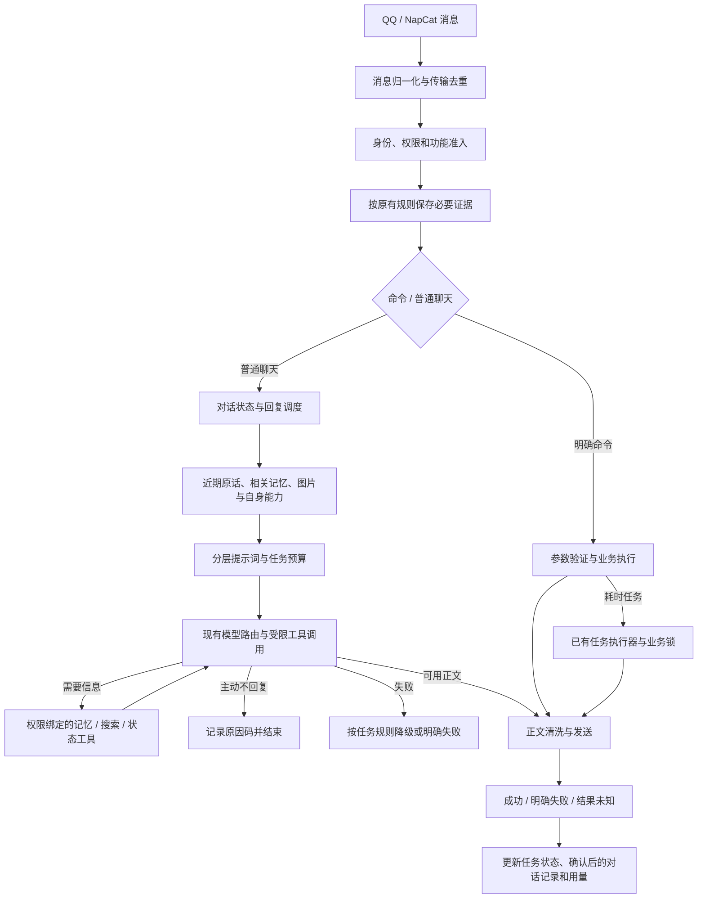

# QQFriend Linux 智能化与模块化总路线

规划日期：2026-09-23。代码核对基线：`1.4.12-model-refresh` / `1c4ab31`。

本文描述分阶段改造目标，不代表全部功能已经实现或部署。用户已授权按目标持续执行且仅更新 Linux；P0 已完成，P1 能力状态/自述/梗库退役和 P2 生命周期保护、提示词分层及完整轮次已分批部署，其余目标尚未完成。实际发布以每批验收记录为准；服务器私有配置、模型路由和 Windows 安装均保持不变。

最终版本约定（用户指定）：本轮 P0-P5 改造完成并通过整体验收后，正式版本统一为 **`2.0.0`**。阶段性 `1.4.x` 交付不代表 2.0.0 已完成；不得仅改版本号跳过剩余目标。最终同步 package/lock、版本命令与中英文更新说明、前端、服务器镜像和 GitHub 记录，并备份、重新拉起、核验实际运行版本。

配套阅读：[模块边界与目标实现](MODULAR-RUNTIME.md)。本文回答“为什么改、按什么顺序改”；配套文档回答“落在哪里、怎样实现、怎样验收”。阶段状态只在本文维护，具体任务状态在配套文档维护。

## 1. 总目标

让夜星准确理解当前对话对象和问题，知道自己当前可以做什么、刚才实际做成了什么；缺信息时按需查询，有依据地使用记忆，最后再减少重复计算和无效模型开销。

模块化贯穿全部阶段。成功标准不是新增了多少模块或提示词，而是重复管线更少、权限更清楚、回答更贴题、失败更可解释，并且能够独立验证和回滚。

## 2. 范围与不变项

- Linux 是唯一更新和部署目标，使用 `agent/linux-server-preview`；Windows 安装冻结，不同步安装目录、不编译桌面 EXE、不启动 Windows Bot。
- 保留 NapCat / OneBot 接入、现有管理员和群/私聊白黑名单；不同功能的准入规则不能擅自合并。
- JM 是必须保留的正式能力，不属于梗库退役范围：群聊和私聊下载、各自白名单、大写 `FS` 压缩密码、上传确认和现有约一天后的临时文件清理规则继续保留；依赖、压缩和上传链路必须纳入 Linux 回归。
- 保留认证 helper、逐跳 URL/DNS 安全检查、私有推理隔离、发送确认和隐私遗忘代次保护。
- 保留现有各任务的模型实例、主备分配、思考档位与 DeepSeek 降级能力。DeepSeek 在部分任务是主模型，不能统一当作兜底。
- 不改关系评分算法，不启用关系表导出，不把熟悉度变成恋爱系统。
- 不迁移机器人框架，不先换数据库，不先引入向量数据库、知识图谱、微服务或多智能体。
- 不默认增加每轮画像生成、自我反思、意图判定等额外模型请求。
- 不为了缓存命中保留过时记忆、扩大隐私范围、补无用文字或复用不合时宜的旧答案。

## 3. 目标链路

传输重投去重、对话复读过滤和日报取材去重不是同一件事。必须保留已授权的日报取材与先后顺序，不能因为抑制回复或学习复读而漏采有效证据。

图中的工具回路必须有次数、时长和用量上限，不代表无限 Agent 循环。明确命令继续走确定性解析，不先让模型猜命令。

## 4. 核心改变

### 4.1 梗库退役，而不是新增一套梗库

停止梗库自动采集、自动释义、定时更新和提示词注入；从活跃能力、命令帮助和前端日常入口退出。旧数据先在服务器私有位置归档，人工整理过的内容不直接删除。

保留图片理解、表情素材与发送、B站/GitHub/普通链接预览、现有联网搜索。陌生表达需要查证时按需检索，搜索资料带来源并作为不可信资料处理；没有查到时不编造固定解释。不再定时把网络热词变成自动生效的词典。

兼容入口先提供明确停用状态，确认所有调用方迁移后删除死代码。不能永久保留两套自动更新和提示词注入机制。

### 4.2 从拼接历史转向维护对话状态

明确发送人、被提及者、引用关系、当前问题、已尝试事项、用户纠正和待确认结果。多话题不混成一个群级摘要；新问题可以结束旧话题，不强行续接。

主动沉默、需要追问、模型失败和发送失败必须分开。移除用随机短句掩盖模型失败的路径，主动沉默不触发备用模型强行作答。

### 4.3 记忆有来源、范围和寿命

显式称呼/偏好、事实事件、对话状态与模型推测分开保存和使用。每条可持久化信息要能够对应来源和授权范围；纠正使旧结论失效，复读不抬高可信度。

近期原话优先，旧信息按需查询；达到预算再压缩旧段，保留近期原话、纠正和来源。私聊继续遵守现有不默认长期保存的边界，不能因改造增加采集范围。

### 4.4 机器人具有受控的自身信息

自身信息包括稳定身份、当前可用功能、调用者权限内的运行状态，以及有回执的任务结果。来源是实际注册表、配置、路由和任务记录，不是模型自己生成的“自传”。

功能存在、已启用、当前用户有权使用、当前服务健康分别表达。模型名称以本轮实际解析的模型实例为准，发生降级时同步更新；不知道的状态明确为未知。

不向模型提供完整源码、密钥、内部地址、服务器路径或其他群的信息；了解自身不等于获得任意系统操作权限。

### 4.5 提示词工程和缓存一同设计

稳定身份、边界、任务规则和少量示例在前；动态能力、授权记忆、对话/图片资料和最新问题在后。固定内容与工具声明顺序稳定，不在前缀插入随机风格、请求编号和不停变化的状态。

聊天、插话、日报、识图分别维护任务模板，复用身份和必要边界。猫娘风格保留，但不替代回答内容。资料、原话与推测分开，提示词中的限制不替代后端鉴权。

区分 API 前缀缓存和本地计算结果缓存。图片客观识别可按内容哈希及版本复用，但表情包的当次语境解释不能只按图片缓存；普通聊天最终答案默认不做语义近似复用。

## 5. 分阶段路线

| 阶段 | 交付目标 | 依赖 | 状态 | 阶段门禁 |
| --- | --- | --- | --- | --- |
| P0 基线与退路 | 核对线上版本，保存受限备份，建立质量与成本基线 | 无 | 已完成，2026-09-23 | 备份隔离恢复可读、Linux 门禁通过；合成质量问题已记录 |
| P1 能力与事实 | 统一能力来源和结果语义，受控自描述，梗库退出活跃链路 | P0 | 进行中：能力状态、受控自述、聊天结果与梗库退役已上线 | 帮助/前端/自述一致，停用不损坏其他模块 |
| P2 对话核心 | 对话状态、回复调度、分层提示词和明确失败路径 | P1 | 进行中：生命周期、分层提示词、完整轮次、发送状态和引用来源已上线，队列/整体状态仍待改造 | 不串对象、不假成功，沉默不触发降级 |
| P3 记忆与工具 | 来源化记忆、按需检索、图片上下文和受限工具回路 | P2 | 记忆/纠正、只读工具、状态查询和图片工程链路已上线；图片动机推断仍有质量缺陷，更广事件状态待实施 | 不越权，纠正/遗忘/失败都可验证 |
| P4 成本与缓存 | 稳定前缀、本地必要缓存、重复计算合并、用量对照 | P3 | 进行中：精确范围图片缓存及按模型/任务/主备/提示词/思考模式的用量对照已上线；并发合并、剩余模板与受控成本比较未完成 | 实测收益且质量、隐私和新鲜度不退步 |
| P5 整体验收 | 前端整合、固定案例回放、单群试运行、扩大发布 | P1-P4 | 未开始 | Linux 门禁通过，真实表现达标，可回退 |

每个阶段内部拆成小批次，满足门禁后独立提交和发布。前端、测试、文档随各批次同步，不拖到 P5 才补。P5 是整体验收，不是前四阶段免验收的理由。

## 6. 模块化原则

- 保持模块化单体和现有部署形态；文件多少不作为成果指标。
- 调度层组织流程；功能模块使用稳定入口，不能越过权限直接读其他模块私有存储。
- 能力、配置、记忆和发送状态分别只有一个权威来源，兼容适配器不另存一份事实。
- 只对真实的重复行为、独立状态或替换需求抽象，不搭建万能事件总线或插件框架。
- 并发合并只针对同一授权范围内的只读计算，不合并不同收件人的外发，不把未知发送结果视为可重试。
- 旧入口需要退出条件；迁移期只能有一个正式发送者和一个权威写入路径。
- 每阶段清点新增入口、重复路径、兼容调用方与可删除代码，复杂度增加需要说明理由。

## 7. 验收与质量评价

工程门禁执行现有安装、lint、测试、发布检查和上下文回放；运行时变更再做隔离启动、`/health`、`/ready` 和候选 Linux 验证。不得启动第二个连接真实 QQ 的测试实例。

P0 固定合成或明确授权且脱敏的样例，覆盖：多人同名/@/引用、多话题、接续提问、纠正、陌生梗、图片语境、称呼更新、遗忘、无权限、模型失败、发送未知、工具循环和重复事件。原始聊天与截图不上传 GitHub。

对照评价至少记录：回答对象是否正确、是否贴题、是否编造执行结果、纠正是否生效、不必要插话、实际调用次数、输入/输出/思考 Token、缓存明细和耗时。隐私越界、推理外发、错误收件人、重复发送为阻断项，不能用平均分抵消。

`replay:check` 的输入与预算检查不是模型语义验收。真实模型回放沿用现有限额，先确定调用预算，记录主备与工具轮次；同一案例在一致模型配置下比较，不靠反复热身制造虚高缓存指标。不承诺固定省费比例或所有问题零误解。

## 8. 前端交付

在现有页面模块内逐步增加能力状态、对话来源、记忆编辑/纠正/遗忘、任务结果、提示词版本对比和用量缓存对照，不另建一套控制台。

保存、分析、取消、预览和发送均有明确状态与错误反馈；刷新后恢复任务观察，不自动重提。用户可以修改事实与风格配置，不能把模型生成内容自动提升为系统指令。诊断默认只展示元数据，原文预览需受权限与留存限制，不展示私有推理。

## 9. 发布与回滚

1. 先核对工作区与线上实际版本；SSH 未验证时不能宣称已备份或已部署。
2. 源码安全备份不含私密数据；服务器配置、任务账本和记忆另做访问受限备份，记录保存位置和恢复方法但不公开内容。
3. 优先增加兼容字段和读适配，暂不破坏旧数据；回滚要考虑上线后新增数据，禁止拿旧备份直接覆盖新聊天和发送账本。
4. 本地验证、隐私扫描、明确暂存、提交并推送现有 GitHub 分支；核验远端提交和 Linux CI。
5. 运行时变更构建候选镜像，核验后切换 Linux 发布目录；保留旧镜像和旧发布目录，再重新拉起 Bridge。
6. 切换检查版本、服务就绪、NapCat 连接、关键配置和本轮接口；单群试运行时旧/新链路不得同时发消息。
7. 发生阻断项立即停用新路径并回滚；未知发送回执保留原状态，不自动补发。
8. 纯规划文档提交不更新运行版本，不为了文档重启或部署服务器。GitHub 同步不等于服务器部署。

## 10. 参考与取舍

以下为已检查的特定源码，不代表审计过对方整个项目。借鉴机制，不整套移植；直接复用代码前单独确认许可证与项目兼容性。

| 参考 | 借鉴 | 不照搬 |
| --- | --- | --- |
| [Koishi 权限感知帮助](https://github.com/koishijs/koishi/blob/5525cfd06e0e48be0d65fa31a0ce46d0dc65ffde/plugins/common/help/src/index.ts) | 注册信息生成权限内的帮助和能力说明 | 整体换命令框架 |
| [MaiBot 记忆工具](https://github.com/Mai-with-u/MaiBot/blob/6c7ef47c592b5b383d119f330045ea24f3f5e32a/src/maisaka/builtin_tool/query_memory.py) | 按需查询、结构化结果与来源 | 让模型关闭过滤或扩大检索范围 |
| [AstrBot 上下文预算](https://github.com/AstrBotDevs/AstrBot/blob/95e98b8aed75d56713666eff39e31bafffd95426/astrbot/core/agent/context/manager.py) | 按轮次和 Token 阈值处理旧上下文 | 每轮付费压缩或混用不同会话 |
| [DeepSeek 缓存说明](https://api-docs.deepseek.com/guides/kv_cache/) | 根据实际命中字段和前缀持久化规则优化 | 假定相同前缀下一次必定命中 |
| [MiMo 缓存计费说明](https://mimo.mi.com/docs/zh-CN/quick-start/usage-guide/text-generation/batch-api) | 区分缓存输入与正常输入用量 | 把离线 Batch 用于即时聊天或固化过期价格 |

## 11. 历史交付记录

下面保留原 Linux 推进记录，只用于说明已有基础，不代表 P0-P5 已完成。2026-09-07 起优先更新 `agent/linux-server-preview`，Windows 安装暂停同步。

### 11.1 原第一阶段：诊断和验证

本阶段交付 `1.4.4-linux-diagnostics`：

- 真实消息按异步上下文记录准入、路由、上下文预算、API 调用、输出清洗和发送结果。
- 仅保留最多 300 条、24 小时的内存元数据，不保留聊天正文；重启即清空。
- Linux 浏览器「诊断」页按结果、群号或消息编号筛选，查看阶段时间线。
- 8 个合成对话样例使用现有提示词、上下文格式和输出清洗；前端可生成候选、设为基线、保存固定选项评价。
- `npm run replay:check` 检查输入预算与输出边界，不调用模型。模型生成每次只运行选中的样例，必要时进入备用；每天最多 20 次尝试。
- 合成图例使用已写明的客观描述，不能替代真实视觉识别测试。合成上下文不调用线上历史检索，不能把样例检查通过宣称为记忆召回质量通过。

### 11.2 原后续阶段记录

`1.4.6-summary-workbench` 已将日报作为首个任务工作台：按日证据、讨论分析、可编辑草稿和统一分段发布。`1.4.7-modular-runtime` 将同一执行机制接到梗库更新/查证、表情操作及回放生成，并整理前端、JM、记忆、存档和兼容入口；不引入分布式队列或自动业务重试。详见 [模块维护说明](MODULAR-RUNTIME.md)。

第一阶段之后已交付 `1.4.5-context-selection`：中文分词与同义表达召回、引用链和提及对象选择、旧任务退出、历史图片范围收紧、前端来源记录，以及实际调用选择函数的新增合成回放。后续可根据真实评价继续改进召回准确率；本轮未引入向量数据库或自动长期事实写入。

1. 收集回放评价和错误场景，继续验证中文同义表达、群聊对象及主动偏好纠正的覆盖面。
2. 完善 Compose 服务安装、容器缺失诊断、可验证备份与部署回退。`unless-stopped` 不能重建已删除的容器，也不能跨过人工停止指令。
3. 日报、表情分析、梗库更新和回放已共享任务机制；后续再评估下载任务是否需要独立的可查看进度，保持现有下载互斥和清理规则。
4. 对照任务耗时、缓存、用量和人工质量评价，调整路由与上下文预算。

Windows 运行目录继续冻结。每阶段完成验收后单独发布、备份并部署服务器。
